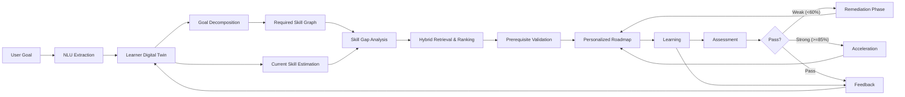
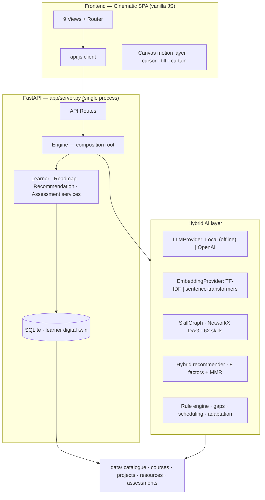
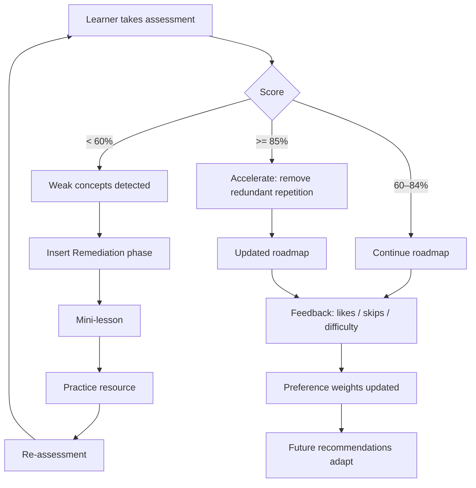
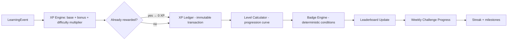
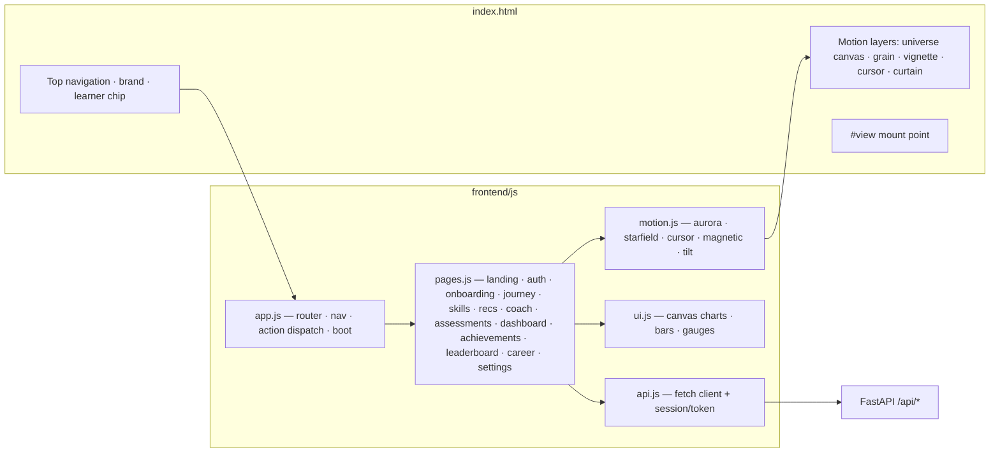

# 🧭 LearnPath AI

### Your Goal. Your Skills. Your Adaptive Learning Journey.

LearnPath AI is an **AI-powered Personalized Learning Path Recommender** — an adaptive
**AI Learning Operating System** that understands a learner's goal, current capabilities,
interests, constraints and history; identifies skill gaps; builds an **explainable,
prerequisite-aware learning journey**; and continuously adapts the roadmap from
assessments, feedback and behavior.

> LearnPath AI is not a course recommender. It is an adaptive AI learning companion
> that continuously transforms a learner's goal into an executable, personalized and
> measurable journey.

---

## 1. Problem Statement

Thousands of courses, projects and resources exist, but learners don't know **what to
learn next**. Generic recommenders surface popular or similar courses; they ignore:

- **Skill gaps** — what the learner actually lacks for their goal,
- **Sequencing** — prerequisites that make a path learnable,
- **Constraints** — weekly hours, deadlines, learning preferences,
- **Progress** — whether the learner is actually improving,
- **Adaptation** — that a struggling learner needs a different path than a thriving one.

## 2. Solution Overview

LearnPath AI replaces "User → LLM → random courses" with a deterministic, explainable
pipeline:



The LLM is used only where language matters (conversational understanding,
explanations, coaching, content generation). Everything deterministic — prerequisite
ordering, gap math, ranking, scheduling, adaptation — uses rule/graph engines and
algorithms.

## 3. Key Features

| Area | Features |
|---|---|
| **Landing + Auth** | Cinematic marketing landing page; sign-up / sign-in with PBKDF2-hashed passwords + session tokens (stdlib only); **one-click guest demo mode** — evaluators explore personas with no account |
| **Onboarding** | Conversational NL intake with an editable "AI Understanding" panel; one-click demo personas |
| **Learner Digital Twin** | Dynamic profile: skills + confidence, interests, preferences, hours, deadline, history, feedback |
| **Skill Intelligence** | 62-skill ontology (NetworkX DAG), prerequisite closure, topological ordering, gap heatmap, radar, before/after |
| **Hybrid Recommender** | 8 explainable signals, configurable weights, MMR diversity, machine-readable reasons + "Why this?" |
| **Learning Path** | Constrained scheduling: prerequisites → phases → weeks → deadline feasibility; Balanced/Accelerated/Flexible modes |
| **AI Coach** | RAG assistant that knows your profile, roadmap, gaps and assessments; honest when it doesn't know |
| **Assessments** | 13 knowledge checks (MCQ/multi-select/scenario/coding), concept-level weak-area detection |
| **Adaptive Engine** | Failing a check inserts a Remediation phase (micro-lesson → practice → re-check); strong scores accelerate |
| **Career Readiness** | 0–100 index across Technical / Projects / Problem Solving / Deployment / Portfolio + "what's needed for 90%" |
| **Daily Mission** | Today's concrete plan sized to weekly hours; smart weekly time planner with missed-session recovery |
| **What-If Simulator** | Switch target role → see transferable vs additional skills and extra time |
| **Micro-learning** | "Learn this in 10 minutes" lessons for weak concepts; AI project generator |
| **LearnPath XP** | Outcome-based gamification: XP ledger, levels, ranks, streaks, badges, weekly challenges |
| **Leaderboards** | Fair All-Time / Weekly / Monthly / Skill / Mastery boards — weekly & monthly reset so new learners can compete; opt-out privacy toggle in Settings |
| **Reliability** | Offline-first: full local fallback for LLM & embeddings; schema validation; graceful failures |

## 4. Architecture



```
app/
├── server.py               # FastAPI: JSON API + serves the SPA (single process)
├── config.py               # Weights, thresholds, modes, personas (env-overridable)
├── ai/
│   ├── embeddings.py       # Embedder abstraction: TF-IDF (default) | sentence-transformers
│   ├── llm.py              # LLMProvider abstraction: Local (offline) | OpenAI
│   ├── extraction.py       # Rule-based + LLM-upgraded profile parsing (validated JSON)
│   ├── prompts.py          # Centralized prompt templates (system/context/knowledge/question)
│   └── rag.py              # Knowledge base + context-aware CoachService
├── ml/
│   ├── recommender.py      # Hybrid scoring, MMR diversification, explanations
│   ├── skill_gap.py        # Gap engine (via SkillGraph)
│   ├── path_optimizer.py   # Roadmap generation + adaptive remediation
│   ├── career_readiness.py # Readiness index
│   ├── daily_mission.py    # Today's mission + smart time planner
│   ├── what_if.py          # Goal-switch simulator
│   ├── personalization.py  # Proficiency estimation, preference adaptation
│   ├── evaluation.py       # Synthetic-benchmark metrics (Precision/Recall/NDCG/Diversity)
│   ├── gamification.py     # XP engine: rules, levels, ranks, streaks, badges, leaderboards
│   ├── gamification_service.py  # Event pipeline: XP award → level-up → badges → challenges
│   └── demo_seed.py        # Realistic demo learners + gamification state for the leaderboard
├── graph/skill_graph.py    # NetworkX DAG: prerequisites, closures, topological order
├── data/                   # Catalogue: skills, roles, courses, projects, resources, assessments
├── database/               # SQLite repository + Learner Digital Twin model
├── services/               # engine (composition root) + learner/roadmap/recommendation/assessment services
├── tests/                  # 109 pytest tests incl. end-to-end FastAPI demo flow + gamification + opt-out suite
└── frontend/               # Cinematic SPA (zero frameworks):
    ├── index.html          #   shell + motion layers (universe canvas, grain, vignette, cursor)
    ├── css/styles.css      #   deep-space design system + glassmorphism
    └── js/                 #   api.js (client) · motion.js (aurora/starfield/cursor/tilt/curtain)
                            #   ui.js (charts + XP/badge FX) · pages.js (13 views incl. landing, auth, Achievements, Leaderboard)
                            #   app.js (router/nav/boot)
```

**AI architecture (hybrid):**

| Component | Role | Implementation |
|---|---|---|
| LLM | conversation, explanation, coaching, generation | `LLMProvider` — Local (offline) or OpenAI-compatible |
| Embeddings | semantic retrieval & matching | `EmbeddingProvider` — TF-IDF (offline, cached) or sentence-transformers |
| Graph engine | prerequisites, ordering, constraints | NetworkX DAG over 62 skills |
| Recommender | ranking, personalization, diversity | weighted 8-factor scoring + Maximal Marginal Relevance |
| Rule engine | gap math, scheduling, adaptation | deterministic functions (no LLM for math) |

## 5. AI / ML Methodology

- **Embeddings**: catalogue items (courses, projects, resources, assessments) are indexed
  with TF-IDF vectors (sublinear TF, 1–2 grams); queries are the learner goal + role
  summary. The index is disk-cached (`data/embeddings_cache/`) so restarts are instant.
  With `EMBEDDING_PROVIDER=sentence-transformers` the same interface uses a MiniLM model.
- **Skill graph**: 62 skills, 80+ prerequisite edges. Topological ordering guarantees
  "prerequisites before dependents"; a greedy *lexicographic* topological sort with
  role-importance keys produces a priority-aware valid order.
- **LLM**: used only for (a) profile extraction (structured JSON, schema-validated, merged
  over rule output), (b) coaching answers grounded in retrieved knowledge (RAG),
  (c) micro-lessons/projects/assessment generation. If the API is unavailable the app
  runs fully in local mode — deterministic and hallucination-free.

## 6. Recommendation Methodology

`Recommendation Score = Σ wᵢ · factorᵢ` with configurable weights
(`app/config.py`, default sums to 1.0):

| Factor | Weight | Meaning |
|---|---|---|
| Semantic relevance | 0.30 | TF-IDF cosine between goal+role and item |
| Skill-gap coverage | 0.20 | how much missing/weak skill it addresses |
| Goal alignment | 0.15 | contribution to the role's competency map |
| Prerequisite fit | 0.10 | learner readiness for this item |
| Difficulty fit | 0.10 | distance from learner's estimated level |
| Preference fit | 0.05 | content format vs learning preference |
| Time fit | 0.05 | duration vs weekly budget |
| Feedback signal | 0.05 | likes/skips/completions history |

A **Maximal Marginal Relevance** pass (`λ=0.7`) diversifies the top-K so the list mixes
courses, projects, resources and knowledge checks. Every result carries
machine-readable reason scores, and the UI renders a human **"Why this?"** built from
those actual signals — never fabricated LLM prose.

## 7. Adaptive Learning Methodology



- **Assessment**: 4–5 questions per check, tagged with concepts. Failing (<60%) exposes
  **weak concepts**; passing strongly (≥85%) enables acceleration.
- **Weak result** → a `Remediation` phase is inserted before the next milestone:
  micro-lesson → practice resource → re-assessment. The learner sees *"Your path was
  updated"* with the exact reasons.
- **Strong result** → redundant repetition is removed.
- **Feedback loop**: likes/skips/difficulty update the preference weights used by the
  recommender, so "keeps skipping long videos" shifts future recommendations toward
  shorter hands-on items.

## 8. LearnPath XP — Outcome-Based Gamification

> *Learn. Build. Master. Rise.* — LearnPath AI rewards **learning progress, mastery and
> consistency**, never busywork. No XP for logging in, viewing pages, or repeated clicks;
> every reward is server-calculated, auditable and anti-farm protected.

Every meaningful learning action emits a **LearningEvent** into a centralized pipeline:



**Key mechanics**

| Mechanic | Details |
|---|---|
| **XP rules** | Configurable in `app/config.py` — e.g. course +100, project +200, capstone +500, assessment +30, daily mission +25, skill mastery +100, remediation +40 |
| **Quality multiplier** | Assessments & projects scale by performance: score 60–74% → +10 bonus, 75–84% → +25, 85–94% → +40, 95–100% → +60; difficulty multipliers 1.0×–2.0× |
| **Anti-farming** | Duplicate completion = 0 XP; daily mission once per day; challenge claims only when genuinely completed; **no arbitrary `POST /xp` endpoint** — the client only reports events, the server computes rewards |
| **XP ledger** | Every reward writes an immutable-style `XPTransaction` (base, bonus, multiplier, final, reason, timestamp) — the UI explains "How did I earn this XP?" |
| **Levels** | Curved thresholds (Explorer 0 → Master 15,000 XP) with a progress bar, "X XP to next level", and level-up detection |
| **Ranks** | Separate competitive hierarchy (Novice → Grandmaster) from levels |
| **Streaks** | Only *meaningful* activity counts (course, assessment, project, mission); milestones at 3/7/14/30/60/100 days award bonus XP + badges |
| **Badges** | 18 deterministic badges (First Step, Knowledge Seeker, Assessment Ace, On Fire, Path Explorer, Capstone Champion…), auto-awarded, re-evaluated so missed events self-heal |
| **Challenges** | Weekly challenges derived from the learner's own roadmap (e.g. "Complete 3 assessments this week") — claimable only when complete |
| **Comeback bonus** | Improve from a failed assessment to a passing re-assessment → +50 improvement XP. Failure is never punished |

**Leaderboards** — fair by design: All-Time, **Weekly** and **Monthly** (XP earned in the
period, so new learners can compete), per-**Skill** (proficiency) and the **Mastery Board**
(skills mastered + career readiness). Demo learners (Alex, Priya, Rahul…) are clearly
labeled as demo data; the current learner is always highlighted and rank movement
(↑/↓/→) is tracked from XP-transaction timestamps.

The AI Coach is gamification-aware: ask *"What do I need to reach Level 8?"* or *"How
can I improve my ranking?"* and it answers from the learner's real XP ledger — and it
steers XP-seeking learners back to meaningful progress rather than farming.

**Gamification API** — `GET /api/learners/{id}/gamification` (XP, level, rank, streak,
badges, next-level) · `GET .../xp-history` (ledger) · `GET .../badges` · `GET .../streak` ·
`GET /api/leaderboard?scope=global|weekly|monthly|skill|cohort|mastery` ·
`GET /api/challenges/current` · `POST /api/challenges/{id}/claim` ·
`POST /api/learners/{id}/mission/complete`.

## 9. Tech Stack

**Backend** — Python 3.11 · FastAPI + Uvicorn · scikit-learn · NetworkX · Pandas · NumPy ·
SQLite (stdlib `sqlite3`) · pytest + httpx · optional `openai` / `sentence-transformers`.

**Frontend** — a hand-built cinematic SPA (no framework, no build step): vanilla ES modules
for routing and views, canvas-rendered aurora/starfield motion layer, custom fluid cursor,
magnetic buttons, 3D-tilt glass cards, curtain page transitions, and scroll-reveal
animation. All styling is custom CSS (Space Grotesk / Inter / JetBrains Mono).



## 10. Dataset

`data/` contains a curated, offline catalogue across 7 domains (AI/ML, Data Science,
Data Analytics, Cybersecurity, Cloud, Software Dev, Web Dev):

- `skills.csv` — 62 skills with category, difficulty, prerequisites, related skills
- `career_roles.csv` + `career_role_skills.csv` — 10 roles with per-skill target proficiency
- `courses.csv` — 52 courses with **verified external URLs** (Kaggle, Google, fast.ai, HF,
  OWASP, official docs…) — no fabricated ratings or certifications
- `projects.csv` — 25 projects with deliverables, dataset hints, evaluation guidance
- `resources.csv` — 31 micro-resources (articles, cheatsheets, labs)
- `assessments.json` — 13 knowledge checks, 52 concept-tagged questions

## 11. Installation

```bash
git clone <repo> && cd LearnPath-AI
python -m venv .venv && source .venv/bin/activate   # Windows: .venv\Scripts\activate
pip install -r requirements.txt
```

## 12. Environment Variables

Copy `.env.example` to `.env` (all values optional — the app runs fully offline without any):

| Variable | Default | Purpose |
|---|---|---|
| `LLM_PROVIDER` | `local` | `local` (offline) or `openai` |
| `OPENAI_API_KEY` | — | enables real LLM (extraction, coaching, generation) |
| `OPENAI_MODEL` | `gpt-4o-mini` | model name |
| `EMBEDDING_PROVIDER` | `tfidf` | `tfidf` (offline) or `sentence-transformers` |
| `DATABASE_PATH` | `data/learnpath.db` | SQLite location |

## 13. Running Locally

```bash
python -m uvicorn app.server:app --port 8765
```

Open http://localhost:8765. Start with a **demo persona** (one click) or type your own
goal. No API keys required. The same process serves the JSON API and the cinematic SPA.

## 14. Demo Credentials

None required. Use the **"Try a demo profile"** tiles: Aspiring ML Engineer,
Data Scientist, Cybersecurity Analyst, Cloud Engineer.

## 15. Screenshots

Capture from the running app. The recommended shot list for a submission deck:

1. Onboarding hero + demo personas
2. "AI Understanding" extraction panel
3. Skill Intelligence radar + gap heatmap + before/after bars
4. My Learning Journey roadmap timeline (8 phases, week ranges, statuses)
5. Recommendations with an expanded "Why this?" panel
6. Assessment result showing weak concepts + "Your path was updated" banner
7. AI Coach conversation
8. Progress Dashboard (today's mission, time planner, analytics)
9. Career Readiness gauge + dimension bars
10. What-If simulator
11. Dashboard gamification card (level, XP bar, rank, streak, weekly XP)
12. Achievements page (badges, weekly challenges, XP history)
13. Leaderboard (medals, scope tabs: Global / This Week / This Month / Mastery / My Skill)

## 16. Evaluation Methodology

No human-labeled ground-truth exists for "the ideal learning path", so the evaluation
framework (`app/ml/evaluation.py`) runs a **synthetic benchmark** built from the
catalogue: items are *relevant* when their skills overlap the learner's role competency
map and cover a gap skill. Reported metrics — Precision@K, Recall@K, NDCG@K, catalogue
coverage, type diversity — are explicitly labeled synthetic; their purpose is regression
detection (are gap-covering items ranked above irrelevant ones?) and diversity health.
The evaluator view lives in **Settings → System insights**.

## 17. Testing

```bash
python -m pytest tests/ -q        # 109 tests
```

Coverage: profile parsing, skill normalization, recommendation ranking + explanations,
prerequisite validation, roadmap ordering + feasibility, assessment scoring (MCQ,
multi-select, malformed input), adaptive remediation & acceleration, invalid LLM output,
LLM/embedding fallback, coach honesty, repository round-trips, and an **end-to-end
FastAPI demo flow over real HTTP** (persona → roadmap → skill intelligence →
explainable recommendations → coach Q&A → assessment → adaptive re-planning → career
readiness + what-if → SPA assets served).

The **gamification suite** (`tests/test_gamification.py`, 37 tests) covers XP
calculation, difficulty multipliers, duplicate-completion protection, assessment &
improvement bonuses, level & rank math, deterministic badge conditions, streak
calculation, weekly/monthly/mastery leaderboards, challenge completion & claim gating,
XP-transaction creation, API responses, and **unauthorized XP manipulation** — the
client can never submit an arbitrary XP value; the server is the only XP authority.

## 18. Limitations

- Embeddings are TF-IDF by default (deterministic, offline); sentence-transformers gives
  stronger semantics when installed.
- Local mode composes coaching answers from retrieved knowledge rather than generating
  free text; enabling an LLM key unlocks richer prose.
- Courses/durations are curated estimates; external links are verified but third-party
  content can change.
- Analytics are real (computed from learner state); "demo data" is only what personas
  pre-fill.

## 19. Future Improvements

- PostgreSQL persistence + multi-tenant auth
- Fine-grained progress tracking per resource (watch/read state via linkbacks)
- Community-scale catalogue with ingestion pipeline and dedup
- Calibrated user study for the evaluation benchmark (replace synthetic relevance)
- Spaced-repetition scheduling inside the time planner
- Graph-RAG over learner cohorts ("learners like you")

## 20. Project Structure

See the Architecture section above; the composition root is `app/services/engine.py`,
the catalogue lives in `app/data/`, and the single FastAPI process in `app/server.py`
exposes a thin JSON API over the services while `frontend/` renders every page.

**API surface** — `POST /api/auth/signup` · `POST /api/auth/signin` · `POST /api/auth/guest` (demo mode) ·
`GET /api/auth/me` · `POST /api/auth/signout` · `POST /api/profile/analyze` (NL extraction) ·
`POST /api/learners` (persona or conversation) · `GET/PUT/DELETE /api/learners/{id}` ·
`POST/GET /api/learners/{id}/roadmap` · `POST /api/learners/{id}/recommendations` ·
`GET /api/learners/{id}/skills` · `GET /api/assessments/{id}` +
`POST .../submit` · `POST /api/learners/{id}/coach` · `GET .../mission` ·
`GET .../career` · `POST .../whatif` · `POST .../feedback` · `GET .../insights` ·
`GET .../gamification` · `GET .../xp-history` · `GET .../badges` · `GET .../streak` ·
`GET /api/leaderboard?scope=…` · `GET /api/challenges/current` ·
`POST /api/challenges/{id}/claim` · `POST .../mission/complete` ·
`PUT .../settings/leaderboard-opt-out` (toggle leaderboard visibility).

## 21. Team

Built for the **HCLAmplified Round 2** challenge: *AI-Powered Personalized Learning Path
Recommender*.
